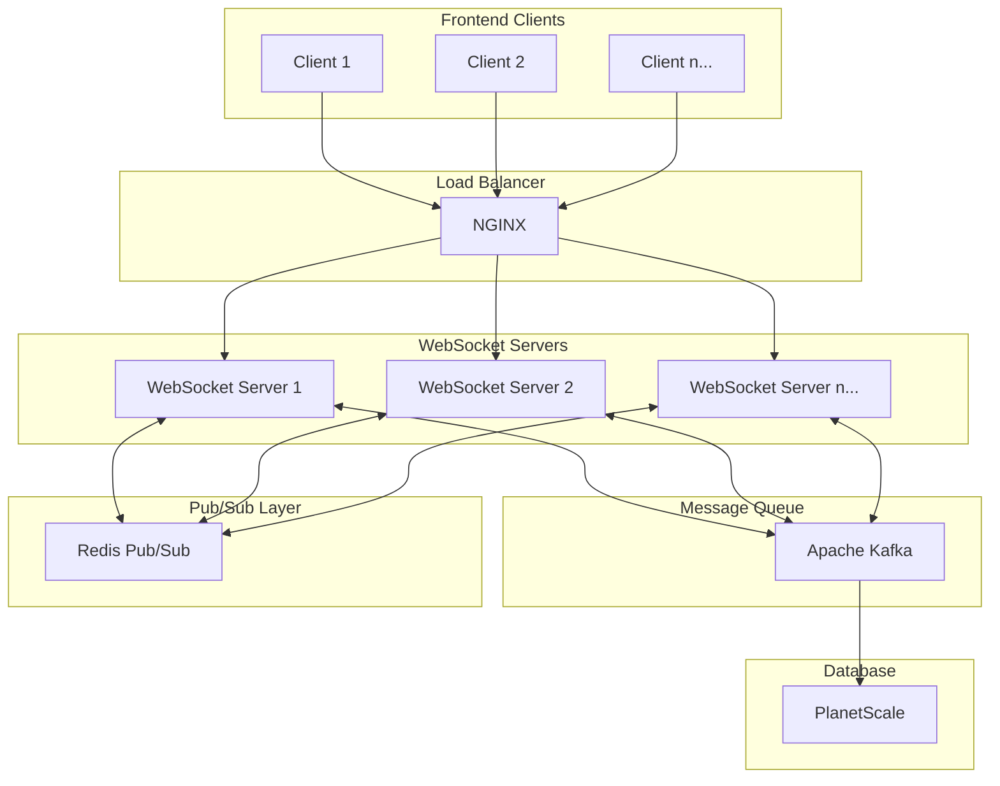
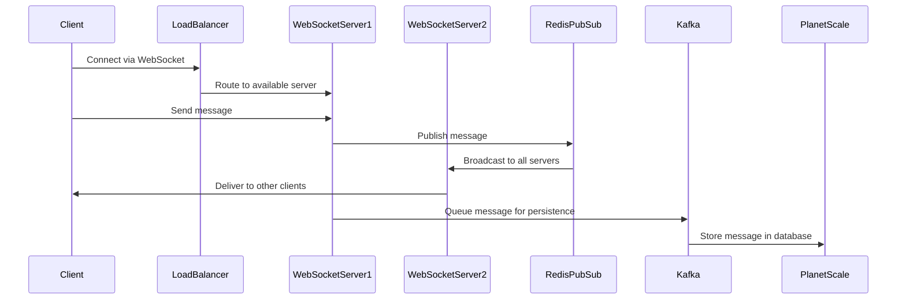

# 💬 Scalable WebSocket Chat Application

<div align="center">

[](https://turbo.build/)
[](https://nodejs.org/)
[](https://nextjs.org/)
[](https://redis.io/)
[](https://kafka.apache.org/)
[](https://planetscale.com/)

A high-performance, scalable chat application built with modern technologies supporting 10,000+ concurrent users.

</div>

## 🏗️ Architecture



### WebSocket Scaling Strategy



## 🚀 Features

- **Real-time Communication**: Low-latency messaging using WebSocket protocol
- **High Scalability**: Supports 10,000+ concurrent users
- **Message Persistence**: Reliable message storage using PlanetScale
- **Load Balancing**: Efficient request distribution with NGINX
- **Microservices Architecture**: Built with Turborepo for better modularity
- **Message Queueing**: Kafka integration for reliable message processing
- **Pub/Sub System**: Redis for real-time message broadcasting
- **High Availability**: 99.9% uptime during peak traffic

## 🛠️ Technical Stack

### Frontend
- Next.js for server-side rendering
- TypeScript for type safety
- WebSocket client implementation

### Backend
- Node.js microservices
- WebSocket server implementation
- Turborepo for monorepo management

### Infrastructure
- Redis Pub/Sub for message broadcasting
- Apache Kafka for message queuing
- PlanetScale for scalable database
- NGINX for load balancing

## 📦 Project Structure

```
├── apps/
│   ├── web/                 # Next.js frontend
│   └── websocket-server/    # Node.js WebSocket server
├── packages/
│   ├── shared/              # Shared utilities
│   ├── database/            # Database schemas
│   └── config/              # Configuration
└── turbo.json              # Turborepo configuration
```

## 🚦 Getting Started

1. **Clone the repository**
```bash
git clone https://github.com/yourusername/scalable-chat-app.git
cd scalable-chat-app
```

2. **Install dependencies**
```bash
npm install
```

3. **Set up environment variables**
```bash
cp .env.example .env
```

4. **Start development servers**
```bash
npm run dev
```

## 💻 Development

### Prerequisites
- Node.js 18+
- Redis
- Apache Kafka
- PlanetScale account

### Running Locally
1. Start Redis server
```bash
redis-server
```

2. Start Kafka
```bash
# Start Zookeeper
bin/zookeeper-server-start.sh config/zookeeper.properties

# Start Kafka
bin/kafka-server-start.sh config/server.properties
```

3. Run the application
```bash
turbo dev
```

## 🔄 Scalability Features

### WebSocket Scaling
- Multiple WebSocket servers handle client connections
- Redis Pub/Sub ensures message delivery across all servers
- NGINX load balancer distributes client connections

### Database Scaling
- PlanetScale handles database scaling automatically
- Kafka manages high-throughput message persistence
- Efficient connection pooling and query optimization

### Performance Optimizations
- Message batching for bulk operations
- Connection pooling for database efficiency
- Caching frequently accessed data in Redis

## 📊 Performance Metrics

- **Concurrent Users**: 10,000+
- **Message Latency**: <100ms
- **Uptime**: 99.9%
- **Message Throughput**: 1000+ messages/second

## 🔐 Security Features

- WebSocket connection authentication
- Rate limiting
- Input validation
- SQL injection prevention
- XSS protection

## 🚧 Future Improvements

- [ ] Implement message encryption
- [ ] Add file sharing capabilities
- [ ] Enhance monitoring and alerting
- [ ] Add support for voice/video calls
- [ ] Implement message search functionality

## 🤝 Contributing

Contributions are welcome! Please read our [Contributing Guide](CONTRIBUTING.md) for details on our code of conduct and the process for submitting pull requests.

## 📝 License

This project is licensed under the MIT License - see the [LICENSE](LICENSE) file for details.

## 👨‍💻 Author

**Mohd Jami Khan**
- LinkedIn: [Mohd Jami Khan](https://linkedin.com/in/mohdjami)
- Portfolio: [mohdjami.me](https://mohdjami.me)
- Email: mohdjamikhann@gmail.com

---

<div align="center">
Made with ❤️ by Mohd Jami Khan
</div>
